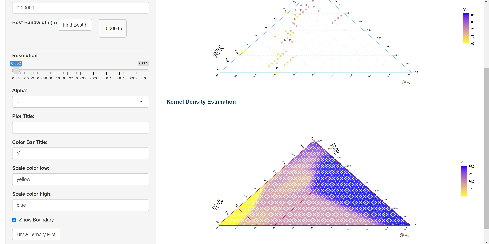
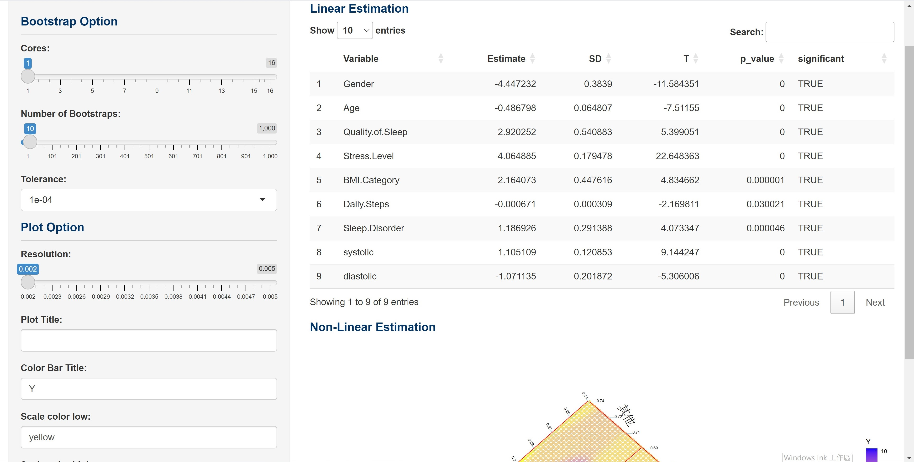

# Dirichlet Kernel Ternary Viewer

An interactive R Shiny application for semi-parametric analysis and visualization of compositional data using Dirichlet kernel smoothing and backfitting.

## 🧠 Features

- Upload your own dataset or use built-in simulated data
- Interactive ternary plots of compositional data
- Dirichlet kernel smoothing with user-defined or cross-validated bandwidth
- Semi-parametric regression via backfitting
- Bootstrap inference for linear covariates
- Parallel computation support

## 📦 Installation

```r
# Required packages
install.packages(c("shiny", "DT", "ggplot2", "shinycssloaders", "MCMCpack", "foreach", "doParallel"))
```
 
 
 

## 📁 App Structure
- **Tab 1: Data Preparation**
  - Upload CSV file
  - Select 3 compositional variables (must sum to 1)
  - Choose covariates and response variable

- **Tab 2: Ternary Plot**
  - Visualize smoothed response using Dirichlet kernel smoothing
  - Adjust bandwidth (`h`) manually or via cross-validation
  - Customize color scale and display options

- **Tab 3: Semi-parametric Estimation**
  - Run backfitting algorithm
  - Bootstrap inference for covariates
  - Visualize residual nonparametric effects


